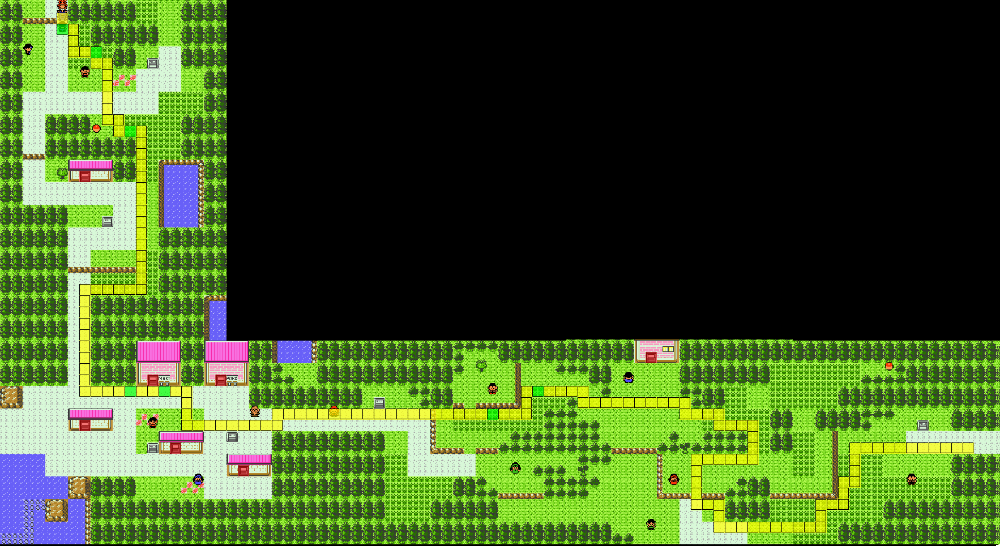

# Mikey Crit Manip

## Goal
This manip aims to continue the [original R29 Manip](https://pastebin.com/3XBwNWUg) to manipulate a crit on Mikey's Pidgey.

## IGT Info
This manip aims for a 7 frame IGT window of 0 - 6.
This manip works on most IGT seconds, but some second/frame/path combinations do not work.

If you are getting a 0 Growl Hit fight from the previous manip with 0 encounters and skipping the berry unequip menu, you should be hitting between IGT second 0 and 6 and this manip should always work.

## FlowTimer Offsets
Target Frame: 3, Offset: 142

These offsets assume that you are not menuing to unequip the berry. If for some reason you fail and get an encounter and are continuing the run, you will need to account for it in FlowTimer.
There should be 0 heal/menus manually added to your timer.

## Misc
For the manip to work, it is assumed that you hold are always holding a button down while text is being printed, and all textboxes are cleared perfectly.
For the fight buffer, you will need to buffer `A -> SELECT -> A` and continue to hold a button for PLD for the crit to work.

## Maps

Path 0

Path 1

Path 2

Path 3

