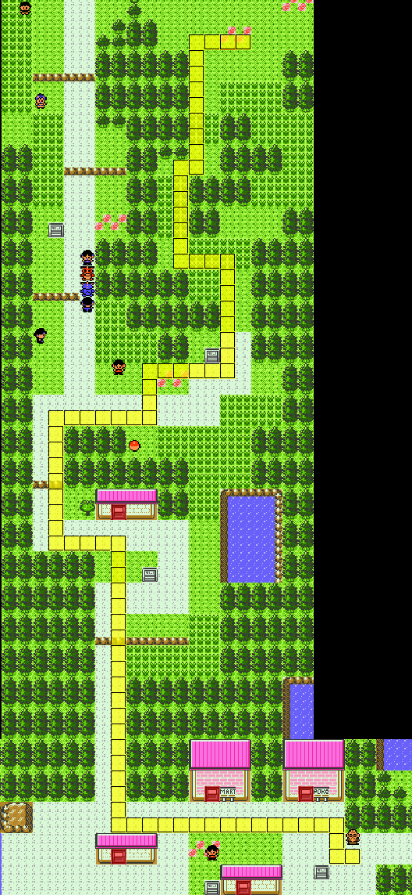
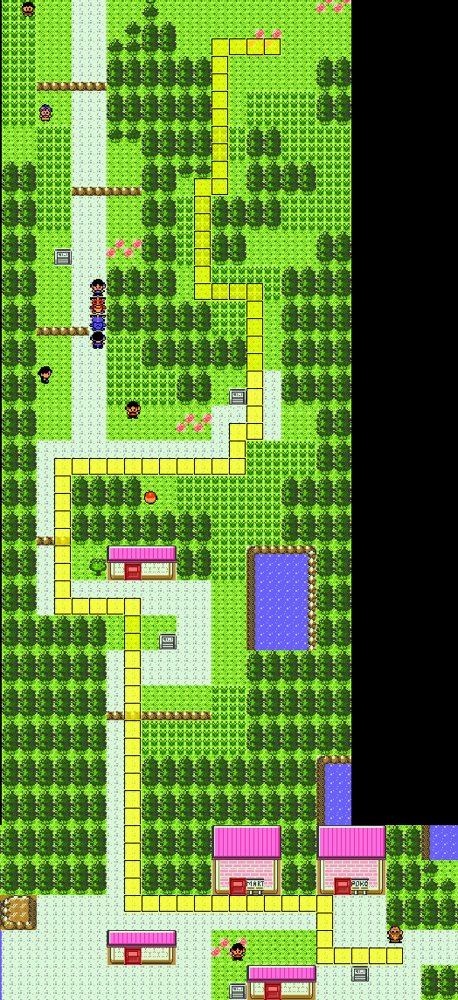

# Route 29 -> Rival 1 Extended

## Goal
This manip aims to continue the [original R29 Manip](https://pastebin.com/3XBwNWUg) through the Mr. Pokemon cutscene to get 0 encounters on Rt30.
This manip also aims to get a Growl fail (or Tackle Miss) turn 1, and a non-Growl hit/Tackle crit on Turn 2. The turn 2 results are a little hit-or-miss.

## IGT Info
There are two versions of this manip depending on which Toto frame you hit. Since the FFFF toto (Frame 61) does an extra start flash, there is an alternate manip that aims for an earlier IGT window if you hit Frame 62 (FFEF)
The FFFF manip aims for IGT 4:43 - 4:47, meaning IGT second = 4, IGT frame = 43 - 47 for a 5 frame window.
The FFEF manip aims for IGT 3:7 - 3:14 or 4:7 - 4:14 for an 8 frame window.

## FlowTimer Offsets
F61_R29 - Target Frame: 45, Offset 200
F62_R29 - Target Frame: 10, Offset 200

These offsets assume that you are not menuing to unequip the berry.

## Misc
For the manip to work, it is assumed that you hold are always holding a button down while text is being printed, and all textboxes are cleared perfectly.
For the potion pickup, this assumption is also true, and the movement to go to the potion from the house is straight down, then straight left.

For the turn 1 buffer, you still need to hold a button down while text is being printed. Turn 2 buffer execution is releasing the PLD button before the last textbox starts printing before turn 2.
For example, if turn 1 is Leer -> Growl Fail, you would hold a button down for the entirety of Leer usage, defense drop, and Growl usage. You would release the button before the "Growl Fail" textbox starts printing.

NPCs cues are useful to try to identify what frame you hit, as some frames you may not want to buffer turn 2. It can also help calibrate your IGT timer on the fly if you can identify exactly what frame you hit relative to the target frame.
An asterisk for any NPC cue means they execute that movement/turn right when they are about to exit the screen.

## Maps
### Path 0

Post Call (F61, aim 4:45)

    

Frame | Rt30 NPC | Cherrygrove NPC | Fight Outcome | T2 Buffer?
----- | -------- | --------------- | ------------- | ----------
4:43  | R        | rL              | Growl -> Leer | Outsped Tackle
4:44  | l        | l               | Leer -> Growl | Outspeed Tackle
4:45  | l        | l               | Growl -> Leer | Outsped Tackle
4:46  | R        | rL              | Leer -> Growl | Outspeed Tackle Miss
4:47  | R        | r               | Growl -> Leer | Outsped Tackle
4:48  | R        | rL              | Growl -> Leer | N/A
4:49  | R        | rL              | Growl -> Leer | N/A

Post Call (F62, aim 3:10 or 4:10)

    

Frame | Rt30 NPC | Cherrygrove NPC | Fight Outcome | T2 Buffer?
----- | -------- | --------------- | ------------- | ----------
3:7   | lL       | r               | Leer -> Growl | Outsped Tackle
3:8   | lL       | r               | Leer -> Growl | Outsped Tackle
3:9   | lL       | r               | Leer -> Growl | Outsped Tackle
3:10  | lL       | r               | Leer -> Growl | Outsped Tackle
3:11  | lL       | r               | Leer -> Growl | Outsped Tackle Miss
3:12  | lL       | r               | Leer -> Growl | Outsped Tackle Miss
3:13  | lL       | r               | Growl Hit (FAIL) | N/A
3:14  | RL       | rR*             | Leer -> Growl | Outsped Tackle Miss

### Path 1

Post Call (F61, aim 4:45)

    

Frame | Rt30 NPC | Cherrygrove NPC | Fight Outcome | T2 Buffer?
----- | -------- | --------------- | ------------- | ----------
4:43  | l        | lrR             | Leer -> Growl | Outsped Tackle
4:44  | l        | lrR             | Leer -> Growl | Outspeed Tackle
4:45  | l        | lrR             | Leer -> Growl | **Outspeed Scratch Crit into Tackle Miss**
4:46  | R        | L               | Growl -> Leer | Outspeed Tackle
4:47  | R        | L               | Leer -> Growl | **Outspeed Scratch Crit into Tackle**
4:48  | R        | L               | Leer -> Tackle Hit (FAIL) | N/A
4:49  | l        | rR              | Growl Hit (FAIL) | N/A

Post Call (F62, aim 3:10 or 4:10)

    

Frame | Rt30 NPC | Cherrygrove NPC | Fight Outcome | T2 Buffer?
----- | -------- | --------------- | ------------- | ----------
3:7   | lL       | lR              | Leer -> Growl | Outsped Growl Fail
3:8   | lR       | rL              | Growl -> Leer | Outsped Tackle
3:9   | R        | lR              | Leer -> Growl | Outspeed Growl Fail
3:10  | RL       | lL              | Growl -> Leer | Outspeed Tackle
3:11  | RL       | lL              | Growl -> Leer | Outspeed Tackle
3:12  | RL       | lL              | Growl -> Leer | Outspeed Tackle
3:13  | RL       | lL              | Growl -> Leer | Outspeed Tackle
3:14  | R        | lR              | Leer -> Growl | Outspeed Growl Fail

### Path 2

Post Call (F61, aim 4:45)

    

Frame | Rt30 NPC | Cherrygrove NPC | Fight Outcome | T2 Buffer?
----- | -------- | --------------- | ------------- | ----------
4:43  | R        | rL              | Leer -> Growl | Outspeed into Tackle Crit (DELAY SCRATCH)
4:44  | l        | r               | Growl -> Leer | Outspeed into Tackle Crit (DELAY SCRATCH)
4:45  | l        | r               | Leer -> Growl | Outspeed Tackle
4:46  | l        | r               | Leer -> Growl | Outspeed Tackle
4:47  | l        | LR              | Leer -> Growl | Outsped Tackle
4:48  | l        | LR              | Leer -> Growl | N/A
4:49  | l        | r               | Leer -> Growl Hit (FAIL) | N/A

Post Call (F62, aim 3:10 or 4:10)

    

Frame | Rt30 NPC | Cherrygrove NPC | Fight Outcome | T2 Buffer?
----- | -------- | --------------- | ------------- | ----------
3:7   | R        | lr              | Leer -> Growl | Outspeed Tackle
3:8   | lL       | rl              | Growl -> Leer | Outspeed Tackle Crit (DELAY SCRATCH)
3:9   | RLL      | lR              | Leer -> Growl | Outspeed Tackle
3:10  | lL       | r               | Leer -> Growl | Outspeed Tackle
3:11  | lL       | r               | Leer -> Growl | Outspeed Tackle
3:12  | lL       | r               | Leer -> Growl | Outspeed Tackle
3:13  | lL       | r               | Leer -> Growl | Outspeed Tackle
3:14  | lL       | r               | Leer -> Growl | Outspeed Growl Fail

### Path 3

Post Call (F61, aim 4:45)

    

Frame | Rt30 NPC | Cherrygrove NPC | Fight Outcome | T2 Buffer?
----- | -------- | --------------- | ------------- | ----------
4:43  | lLR      | rLR             | Growl -> Leer | Outsped Tackle
4:44  | R        | rR              | Growl -> Leer | Outspeed Tackle
4:45  | R        | rR              | Growl -> Leer | Outspeed Tackle
4:46  | RLR      | lR              | Leer -> Tackle Miss | Outspeed Tackle
4:47  | R        | rR              | Leer -> Growl | Outsped Tackle
4:48  | lL       | rL              | Leer -> Growl | N/A
4:49  | lL       | rL              | Leer -> Growl | N/A

Post Call (F62, aim 3:10 or 4:10)

    

Frame | Rt30 NPC | Cherrygrove NPC | Fight Outcome | T2 Buffer?
----- | -------- | --------------- | ------------- | ----------
3:7   | LR       | rR*             | Leer -> Growl | Outsped Tackle
3:8   | RLR      | L               | Growl -> Leer | Outspeed Tackle
3:9   | R        | L               | Leer -> Growl | Outsped Tackle
3:10  | RL       | L               | Leer -> Growl | Outsped Tackle Crit (DELAY SCRATCH)
3:11  | RL       | L               | Leer -> Growl | Outspeed Tackle
3:12  | LR       | rL*             | Growl -> Leer | Outspeed Tackle
3:13  | RL       | L               | Leer -> Growl | Outspeed Tackle
3:14  | LR       | rL*             | Leer -> Growl Hit (FAIL) | N/A

