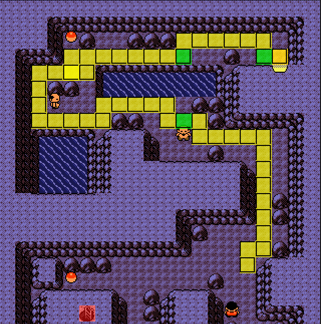

# Rt32 -> Bill Manip

## Goal
This manip aims to continue the [original R32 Manip](https://pastebin.com/Lpbre9aF) to manipulate a perfect Russell pass.

## IGT Info
This manip aims for a 6 frame IGT window of 35-40.

## FlowTimer Offsets
Target Frame: 37, Offset: 30

These offsets assume that you are not menuing to unequip the berry. If for some reason you fail and get an encounter and are continuing the run, you will need to account for it in FlowTimer.
This offset accounts for exactly 1 Potion Menu in Falkner's gym. If you had to use the extra Potion inside the gym, you will need to add an extra `Heal` and `Menu`.

## Misc
For the manip to work, it is assumed that you hold are always holding a button down while text is being printed, and all textboxes are cleared perfectly, including the X Attack pick up.
There are two maps depending on which frame you hit in the manip, identified by the way the spinner turns.

Frame 0/1 share a path, and Frame 2 is uniquely identified and has a different path. I identify Frame 2 by the spinner following this pattern: `rdrdl`
Important: There is a single frame on Path 0 that looks similar to the above spinner pattern, but the spinner will turn `u` at the end.

The movement after the SlowpokeTail guy is to walk Right until you cannot, then walk Down until you cannot.

This manip ensures 0 encounters up until the tile where Bill sees you, but you are free to menu to equip bitter berry/repel any point after you pass Russell successfully.

## Maps

Union Cave Extensions

    
    

