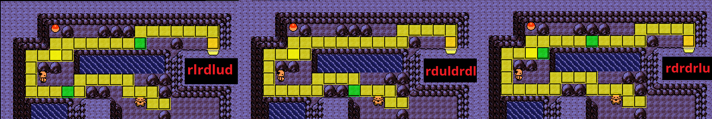

# Rt32 -> Bill Manip

## Goal
This manip aims to continue the [original R32 Manip](https://pastebin.com/Lpbre9aF) to manipulate a perfect Russell pass.

## IGT Info
This manip aims for an 8 frame IGT window of 31-38.

## FlowTimer Offsets Starting Point
Target Frame: 34, Offset: 30 (**Please calibrate your own offset.**)

These offsets assume that you are not menuing to unequip the berry. If for some reason you fail and get an encounter and are continuing the run, you will need to account for it in FlowTimer.
This offset accounts for exactly 1 Potion Menu in Falkner's gym. If you had to use the extra Potion inside the gym, you will need to add an extra `Heal` and `Menu`.

## Misc
For the manip to work, it is assumed that you hold are always holding a button down while text is being printed, and all textboxes are cleared perfectly, including the X Attack pick up.
There are two maps depending on which frame you hit in the manip, identified by the way the spinner turns.

All 3 paths have different union cave movement, identified by the spinner pattern. Frame 1 will require different movement leading up to the SlowpokeTail guy (see map below).

"Normal" spinner cues are included in the Union Cave map image.

This manip only ensures 0 encounters until the Russell pass, any extra steps past this have not been checked.

## IGT Info

IGT Failures

| Delay | Failure IGTs (Second:Frame) |
| ----  | ------------ |
| 0     | 8:37, 9:37, 19:32, 19:33, 45:37 |
| 1     | 9:37, 12:33, 19:33, 33:37, 46:37, 47:31 |
| 2     | 9:37, 12:33, 19:33, 40:33 |

## Maps

Frame 0/2 Rt32 Movement

    

Frame 1 Required Alternate Movement

    

Union Cave Extensions

    

