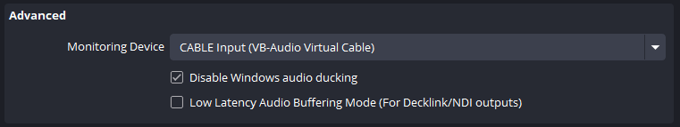
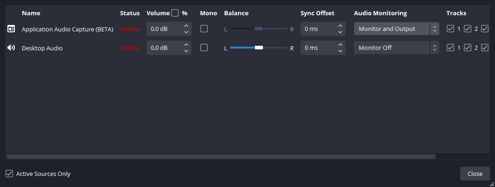
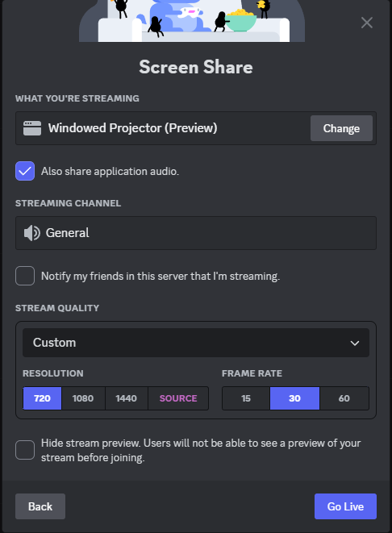

# Pokemon Red 2024 Runner Tech Setup Guide (OBS Preview + Discord Screen Share)

## Why the new setup?
We've had a few stability issues with our current stream setup and we think that moving to Discord will help. We can always fall back to the previous setup if we see issues with this one.

## New Setup Summary
- Runners will use the same OBS Layout and will all join a Discord voice channel.
- Runners will open their OBS preview in a new window and screenshare that OBS preview in the discord call
- The restreamer will be in the voice call and grab everybody's game feed from the shared screens.
- For audio to be shared in Discord, runners will need to setup audio monitoring on OBS (steps outlined below)
- Audio Monitoring enabled means that OBS can output any audio sources to another audio device. The use of VB Cable is to prevent you from hearing any game audio twice (once through your normal audio device, once through OBS' audio montioring)

## OBS Setup

### VB Cable
- If you already have audio monitoring setup on OBS, you can ignore this section.
- Download [VB Audio Cable](https://vb-audio.com/Cable/) [(direct download link for Windows)](https://download.vb-audio.com/Download_CABLE/VBCABLE_Driver_Pack45.zip)
- Extract all files and run `VBCABLE_Setup_x64.exe` as administrator. After the installation is over, you will be required to reboot your computer.

### OBS Audio Monitoring Settings
- In OBS, go to `Settings` -> `Audio`. Scroll down to `Monitoring Device` and set it to `CABLE Input (VB-Audio Virtual Cable)`

    - 

Example

        
        

- In your Audio Mixer, right click and open `Advanced Audio Properties`
- For the audio device that you have playing your game audio, change the `Audio Monitoring` to `Monitor and Output`

    - 

Example

        
        

### OBS Preview
- To setup for the screen share, right click your OBS preview and click `Windowed Projector (Preview)`. Ensure that this windowed preview is maximized. This windowed preview is the application that you will screen share in Discord.
- Once you begin sharing this in discord, you are free to minimize this window.

## Discord Screen share setup
- Once the OBS Windowed Preview is open, join the Discord voice channel and click `Share your screen.`
- In the Screen Share window, go to `Applications`, then select `Windowed Projector (Preview)` and ensure `Also share application audio` is selected.

    - 

Example

        
        
