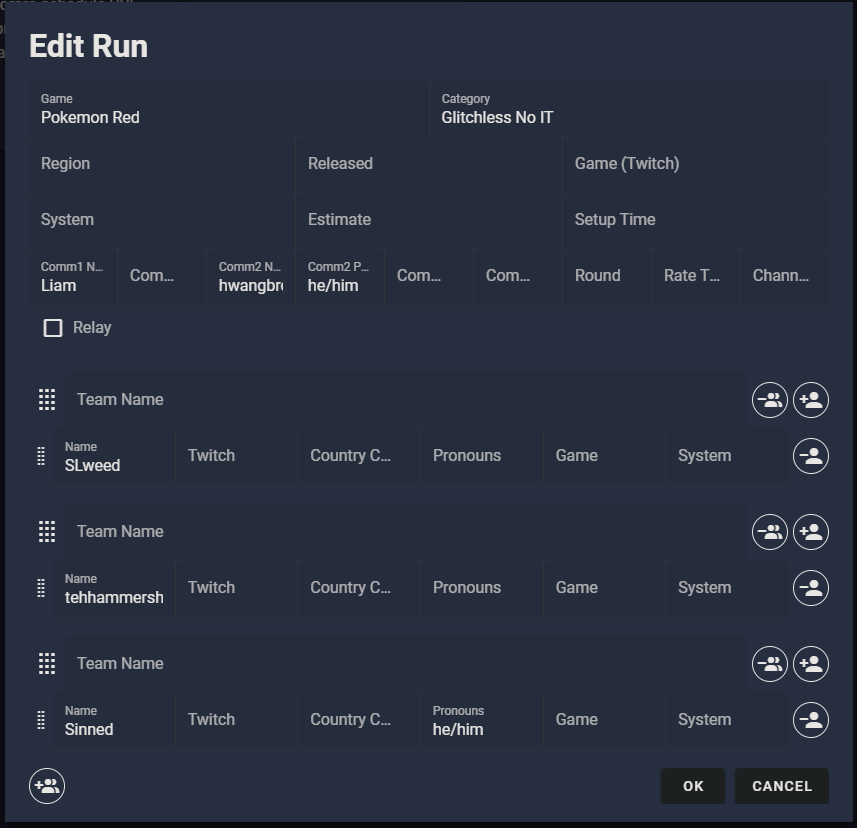

# Notes for Restreaming 2024 Red Tournament

## Pre Race

### Setting up Stage Ten WHIP URLs (getting runner game feeds)
- Visit https://app.stageten.tv/startup, create free account
- Click `Pro Studio` on the sidebar
        

Example

        
        

- Click `Skip` on the next page
        

Example

        
        

- The next steps will have to be repeated for each runner:
    - Click `Add or Invite Feeds` in the top left panel, then open the participant URL in another tab
            

Example

            
            

    - Fill out a name for the runner and click `Accept Invitation`. It will not be displayed anywhere
            

Example

            
            

    - On the next page, click `WHIP Source`, then `Copy` on the `WHIP SERVER URL`.
            

Example

            
            
            

        - You will provide this URL to one runner to use as their OBS WHIP server.
    - Once they have copied this server URL, ask them to click `Start Streaming` in OBS and their feed should appear in the `Pro Studio` tab in StageTen
    - Click on the hamburger context menu in their feed and click `Copy Solo Link`. This is a link you will feed into the restreaming OBS to use as a browser source for this runner.
            

Example

            
            

    - Repeat these steps for each runner until you should have all 3 feeds added into OBS
    - If you are using the restream PC, please generate the broadcast and links on your own system to avoid overworking the PC

### Setting up racetime.gg room
- Create a new room in racetime.gg, join it yourself (as an organizers)
- Communicate with the runners, either via room or voice chat what the palette should be
- When all 3 runners are ready, quit the racetime.gg room in order to start the race
- Make sure to keep the racetime.gg chat room open in case you need to communicate with the runners.

### Setting up nodecg app

#### Creating a new "run"
- On the restream PC, there should be a browser window open that links to `localhost:9090`.
- This is the nodecg app, which is linked to the OBS scenes and controls things like runner names, commentator names, and the main timer.
- To setup a new race, go to the `Run Modifications` tab and click `Edit Currently Active Run` if one exists, otherwise `Add New Run`.
1. Game = `Pokemon Red`
2. Category = `Glitchless No IT`
3. The commentator boxes are laid out as follows. Fill out the name and optional pronoun for all commentators.

        Commentator 1 Name || Commentator 1 Pronouns || Commentator 2 Name || Commentator 2 Pronouns
4. On the layout, each runner is assigned a blank "team". Create one if one doesn't exist.
5. Leave the team name blank, but add the runner's name and optional pronouns to the team.
6. Create a new team for each runner and add their details.
7. The end result should look something like this

Example

#### Starting the timer
- On the `Main Workspace` page, find the run you've created in the `Run Player` section and click `Play Run`. You should see the runner's names in the `Timer` section
- When the race is about to start, keep an eye out on the racetime.gg room. Once the racetime.gg room starts and the timer hits 0, you need to click the play button in the `Timer` section. This will start the timer in the stream layout.
- As each racer finishes or forfeits, you will need to click the respective button next to each runner. As the runner finishes, I like to keep an eye out on the racetime room and try to hit the button as close as possible to when the runner actually finishes.
  - Since this is a manual process, the "end time" may be a bit inaccurate, so rely on racetime.gg for the real results.

Example

### Setting up OBS

#### OBS Scenes
- `Intro`: Intro screen. Discord is not heard on this scene, and music should be hooked up to `foobar`, which is a media player.
- `3 Racers`: Main layout for 3 person race
- `2 Racers`: Main layout for 2 person race
- `2 Racers - Seed 1/2`: Main layout for 3 person race where one person has finished or dropped out. This layout specifically is if the 3rd racer in the layout is out.
- `2 Racers - Seed 1/3`: Main layout for 3 person race where one person has finished or dropped out. This layout specifically is if the 2nd racer in the layout is out.
- `2 Racers - Seed 2/3`: Main layout for 3 person race where one person has finished or dropped out. This layout specifically is if the 1st racer in the layout is out.
- `Setup Screen`: Mostly unused

#### Hooking up game feeds to OBS
- During the race setup, you should be on either `3 Racers` or `2 Racers`
- If you have the nodecg app setup, the layout should be updated for the current race
- For each racer, double click the corresponding browser source and copy and paste the `Copy Solo Link` generated from stageten studio.
  - 

Seed 1 - Browser

    
    

- The runner's feed should appear in the layout and their audio should be detected in the mixer. Repeat this step for all racers

#### Audio setup

- I use the little black gap as a reference point for adjusting audio. This gap will fluctuate, but should overall hover around the same level when audio is playing
- In the above image, the gap can be seen around -40dB
- `Discord` - This is the commentary feed and should remain unmuted the entire time. This feed is usually the loudest, I like to balance the gap around -40 to -35dB
- `Seed # - Browser` - These are the audio feeds for each runner. Only one of these feeds should be unmuted at a time to avoid multiple audio feeds coming through the restream. I usually balance these around -55 to -40dB.
  - The exact value doesn't matter too much: it's more important that the runners' audio are all similar relative to each other.
  - If the volume mixer is maxed for an audio source and they are still too quiet, you can add a `gain` filter to the audio source and manually add it yourself.

### Setting up Commentator Feed in Discord
- Right click the OBS preview and click `Windowed Projector (Preview)` and it should open a preview window. Make sure this window is maximized (full monitor but not full screen-mode)
- In Discord, screen share this preview window. Anyone who watches the screen share should be able to hear the any game feed audio.
- If the preview is very low quality, try to disable and re-enable the preview in the main OBS studio instance.
- The commentators should be in a voice call with the restream account and watch the screen share in order to commentate. Confirm that the commentators are able to hear game audio.

## During Race

### Switch audio feeds
This is more of a convenience factor, but if the lead significantly changes, you can choose to play the audio of the racer in lead. In OBS, mute the audio feed of the runner currently playing and unmute the audio of the runner you want to be playing on stream.

### Switch scenes if necessary
You may need to switch from a 3-player layout to a 2-player layout if someone forfeits. Simply click the corresponding scene that relates to whichever player dropped out and the layout should automatically resolve itself.

### Stop timer on nodecg
As each runner finishes, you'll need to manually mark them as finished in the nodecg app. Open a browser tab for the racetime.gg room and keep an eye out on the race. Once the HoF cutscene starts, watch the room and react to when a runner finishes by clicking their corresponding finish button in nodecg.

## Post Race
- Mute all runner feeds, otherwise the stream might hear an echo if they join the discord call.
- Drag runners into commentator VC if they are unable to join themselves
- End stream once everyone is closing out
